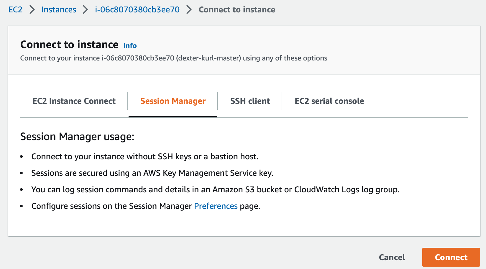

# Terraform Provider KURL

This terraform workflow will quick start all the necessary components for creating an kURL cluster([**kURL**](https://kurl.sh/docs/introduction/)) for multiple cloud provide.

## Requirements
- Terraform version manager [tfenv](https://github.com/tfutils/tfenv)
- Terraform 1.3.3
- AWS Account with IAM Permissions to provision components listed below (AWS Only)

## AWS Components Created (AWS Only)
- EC2 and Auto Scaling Group
- VPC and Subnets
- Security Groups and Policies 
- Elastic IP
- Parameter Store
- IAM and Policies
- S3

## Deploying Insfrastructure and kURL in AWS
1. Run `make deps-aws` to install all the tools if you are using Mac, or follow the instructions to install [aws-cli](https://docs.aws.amazon.com/cli/latest/userguide/getting-started-install.html) and [tfenv](https://github.com/tfutils/tfenv)
2. Run `make setup-aws` to configurate your local aws and terraform environment
3. Create a file called terraform.tfvars with the following content (CHANGE_ME where needed):
    ```
    cluster_name     = "CHANGE_ME"
    aws_region       = "CHANGE_ME"
    env              = "CHANGE_ME"
    vpc_cidr_block   = "10.0.0.0/18"
    account_owner    = "replicated-dev"
    kurl_config_path = "kurl-config.yaml"
    desired_node_size = 0
    public_cidr_block_map = {
        a = "10.0.0.0/22",
        b = "10.0.4.0/22",
        c = "10.0.8.0/22",
    }
    ```
4. If you want to pin your kURL config or copy an existing cluster, create a file called kurl-config.yaml with the following content, otherwise you will use the latest default version:
    ```
    apiVersion: cluster.kurl.sh/v1beta1
    kind: Installer
    metadata:
    name: ""
    containerd:
        version: 1.6.10
    contour:
        version: 1.23.0
    ekco:
        enableInternalLoadBalancer: true
        version: 0.25.0
    kubernetes:
        HACluster: true
        version: 1.25.4
    kurl:
        installerVersion: v2022.11.29-0
    minio:
        version: 2022-10-20T00-55-09Z
    openebs:
        isLocalPVEnabled: true
        localPVStorageClassName: default
        version: 3.3.0
    prometheus:
        version: 0.60.1-41.7.3
    registry:
        version: 2.8.1
    weave:
        version: 2.6.5-20221122
    rook:
        version: latest
    ```
5. Run `make plan` and input variable prompts (if not supplied in variables.tf)
6. Run `make apply` to start creating the infrastructure and kURL cluster.
    - Get some coffee or water, it will take some time (approx 10 minutes) to create and deploy the kURL cluster
7. Once complete you should now be able to get the kubeconfig file as terraform output `terraform output kubeconfig`
8. You can also login into aws console to use (session-manager)[https://docs.aws.amazon.com/AWSEC2/latest/UserGuide/session-manager.html] to connect your kURL master instance without any ssh setup.
9. After login into kURL master instance, you can run following command to check your cluster remotely
    ```
    sudo su
    kubectl get node
    ```
## Clean Up
1. Run `make destroy` or `terraform destroy`